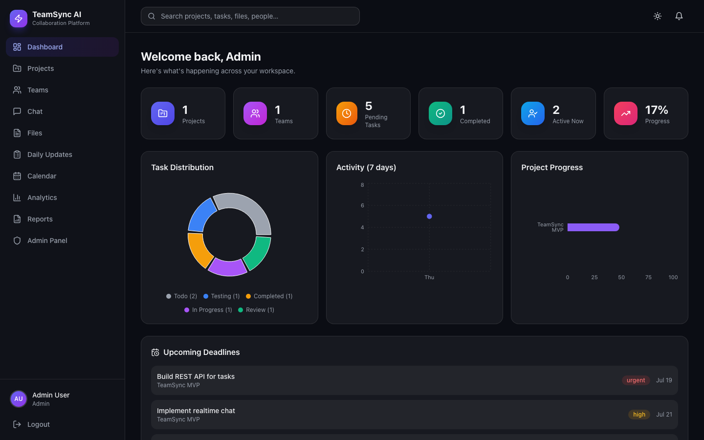
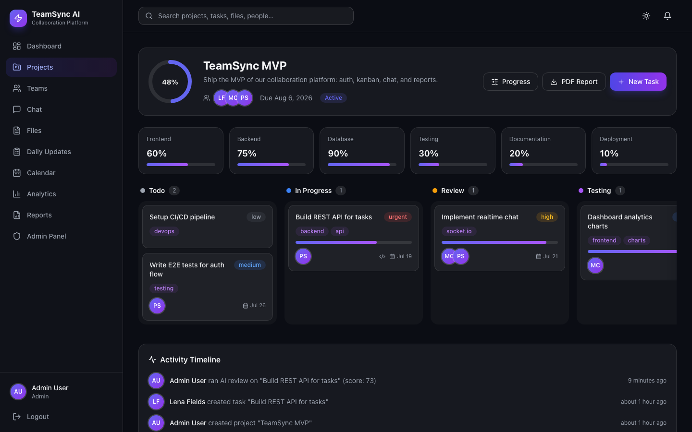
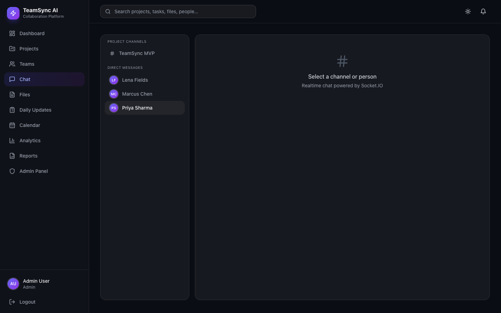
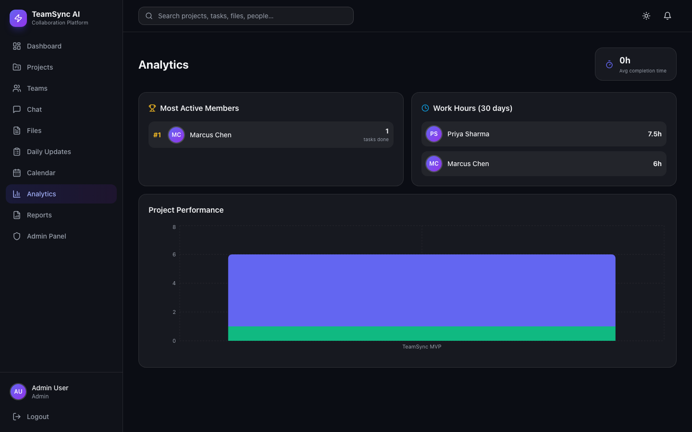
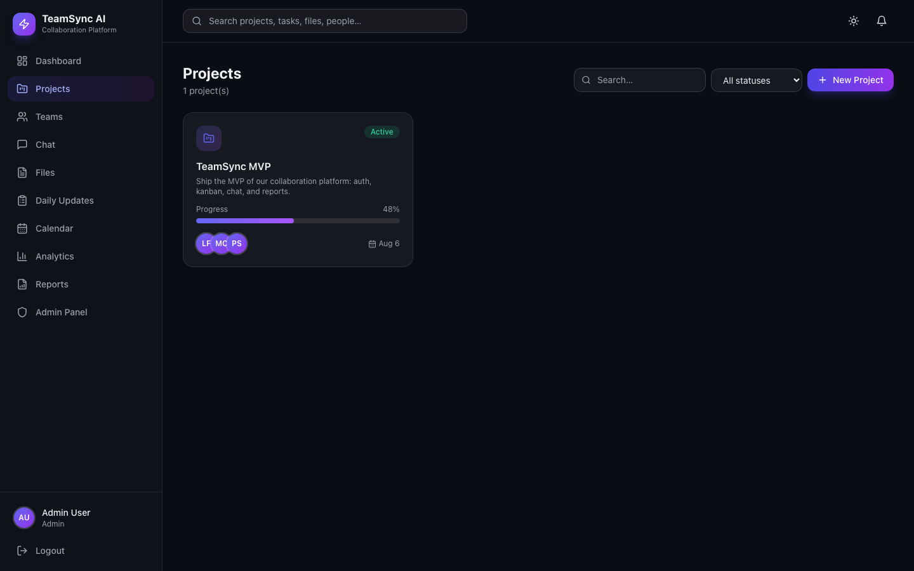
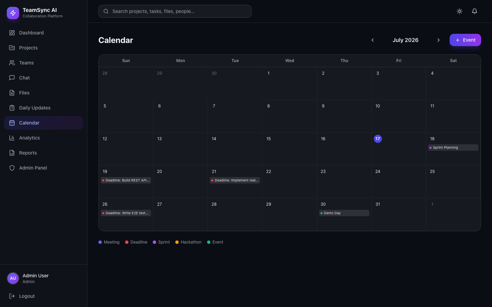
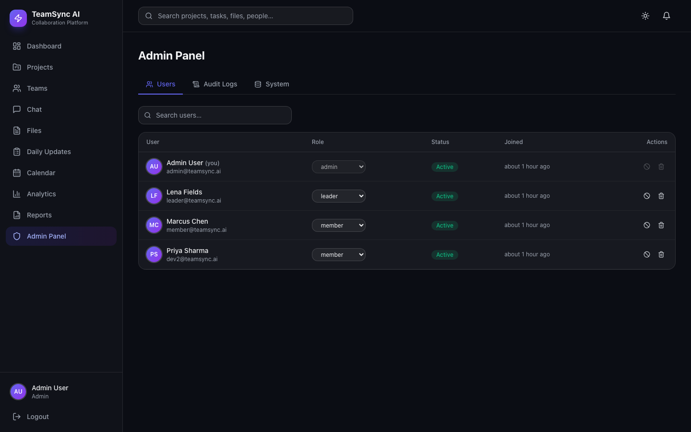
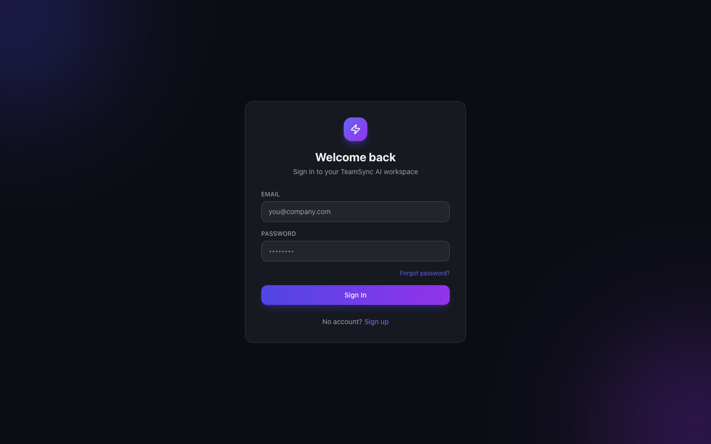

# TeamSync AI

A full-stack team collaboration platform for hackathons, startups, and software teams — projects, Kanban tasks, realtime chat, AI code review, daily updates, PDF reports, analytics, and an admin panel. Built with a modern Apple-inspired glassmorphism UI.

## Screenshots

| Dashboard | Kanban Board |
|---|---|
|  |  |

| Realtime Chat | Analytics |
|---|---|
|  |  |

| Projects | Calendar |
|---|---|
|  |  |

| Admin Panel | Login |
|---|---|
|  |  |


## Tech Stack

| Layer | Tech |
|---|---|
| Frontend | React 18 (Vite), Tailwind CSS, Framer Motion, React Router, React Query, Recharts, dnd-kit, Socket.IO client |
| Backend | Node.js, Express, Mongoose (MongoDB), Socket.IO, JWT (access + refresh rotation), Multer, PDFKit |
| Security | Helmet, rate limiting, bcrypt, mongo-sanitize, httpOnly refresh cookies, RBAC |

## Features

- **Auth** — signup with OTP email verification, login, forgot/reset password, JWT access + rotating refresh tokens, role-based access (admin / leader / member)
- **Dashboard** — animated stat cards, pie/line/bar charts, upcoming deadlines
- **Projects** — progress tracking across 6 areas (frontend/backend/db/testing/docs/deploy), members, deadlines
- **Kanban board** — drag & drop across 5 columns, priorities, labels, deadlines, optimistic updates, realtime sync
- **Code collaboration** — per-task code editor with line numbers, language selector, versions, copy/download
- **AI Code Review** — one-click review returning bugs, security issues, code smells, optimizations, complexity, and a quality score
- **Realtime chat** — project channels + DMs, typing indicators, replies, emoji, read receipts, online presence
- **Daily updates** — today/tomorrow/blockers reports with hours and completion %, leader review
- **Files** — drag & drop upload, image preview, versioning, per-project filtering
- **Calendar** — meetings, sprints, task & project deadlines in a month view
- **Analytics** — member leaderboard, work hours, project performance charts
- **Reports** — downloadable PDF reports (project, member, daily/weekly/monthly)
- **Admin panel** — user/role management, block/delete users, audit logs, system status, JSON database backup
- **Notifications & activity** — realtime via Socket.IO, notification bell, per-project activity timeline
- **Global search** — projects, tasks, users, files, and messages
- Dark/light theme, responsive layout, loading skeletons, code splitting

## Quick Start

### Prerequisites
- Node.js 18+
- MongoDB running locally (`mongodb://127.0.0.1:27017`) or a connection string

### 1. Configure environment

```bash
cp .env.example server/.env
# Edit server/.env — at minimum set JWT_ACCESS_SECRET and JWT_REFRESH_SECRET
```

### 2. Install & seed

```bash
cd server && npm install && npm run seed
cd ../client && npm install
```

### 3. Run

```bash
# Terminal 1
cd server && npm run dev

# Terminal 2
cd client && npm run dev
```

Open http://localhost:5173

### Demo accounts (after seeding)

| Email | Role | Password |
|---|---|---|
| admin@teamsync.ai | Admin | password123 |
| leader@teamsync.ai | Team Leader | password123 |
| member@teamsync.ai | Member | password123 |
| dev2@teamsync.ai | Member | password123 |

## Fallback Services (no API keys needed)

The app runs fully out of the box using fallback drivers. Swap to real services by changing env vars only — **no frontend changes required**.

| Service | Default driver | Real driver | Switch by setting |
|---|---|---|---|
| File storage | `local` (server/uploads) | Cloudinary | `STORAGE_DRIVER=cloudinary` + `CLOUDINARY_*` keys + `npm i cloudinary` |
| Email | `console` (printed to terminal) | SMTP via Nodemailer | `EMAIL_DRIVER=smtp` + `SMTP_*` keys |
| AI code review | `mock` (heuristic static analysis) | Claude (Anthropic) | `AI_DRIVER=anthropic` + `ANTHROPIC_API_KEY` + `npm i @anthropic-ai/sdk` |

> **OTP tip:** with the console email driver, signup OTPs and reset links are printed in the **server terminal**.

## Project Structure

```
teamsync-ai/
├── .env.example
├── client/                  # React (Vite) frontend
│   └── src/
│       ├── components/      # KanbanBoard, TaskModal, CodeEditor, AiReviewPanel, ui/
│       ├── context/         # Auth, Socket, Theme, Toast providers
│       ├── layouts/         # AppLayout, Sidebar, Topbar
│       ├── pages/           # Dashboard, Projects, Chat, Files, Admin, …
│       ├── services/        # Axios client with silent token refresh
│       ├── styles/          # Tailwind + glassmorphism design system
│       └── utils/
└── server/                  # Express API
    ├── config/              # DB connection
    ├── controllers/         # Route handlers (MVC)
    ├── middleware/          # auth (JWT + RBAC), upload, error handling
    ├── models/              # Mongoose schemas (11 collections)
    ├── routes/              # /api/auth + /api/*
    ├── services/            # storage / email / aiReview / pdf (swappable drivers)
    ├── sockets/             # Socket.IO (chat, kanban, notifications, presence)
    └── utils/               # tokens, events, seed script
```

## API Overview

All routes are under `/api` and require a Bearer access token (except `/api/auth/*`).

- `POST /auth/signup | login | verify-otp | refresh | logout | forgot-password | reset-password/:token`
- `GET/POST/PATCH/DELETE /projects`, `/tasks`, `/teams`, `/files`, `/comments`, `/meetings`
- `POST /tasks/:id/code` · `POST /tasks/:id/ai-review` · `POST /tasks/:id/approve`
- `GET/POST /chat/:room/messages` · `POST /chat/:room/read`
- `GET /notifications` · `GET /activities` · `GET /search?q=`
- `GET /analytics/dashboard | performance`
- `GET /reports/project/:id | member/:id | period?type=weekly` (PDF)
- `GET/PATCH/DELETE /admin/*` (admin only: roles, block, audit logs, system, backup)

## Security

JWT with short-lived access tokens + rotating refresh tokens (httpOnly cookie), bcrypt (12 rounds), Helmet, rate limiting (global + stricter on auth), Mongo query sanitization, role checks on every mutating route, blocked-user session revocation, OTP/reset tokens stored hashed.
